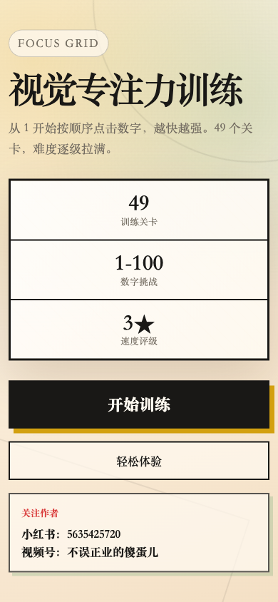

# 视觉专注力训练 H5

一个适合微信朋友圈传播的纯静态 H5 小游戏：从 1 开始按顺序点击数字，49 个关卡，数字数量、颜色干扰、图形密度和字号逐关提升。

## 线上访问

生产地址：

```text
https://blue68.github.io/ctt-games/
```

第 49 关直达：

```text
https://blue68.github.io/ctt-games/?level=49
```

## 宣传效果图



## 运行

直接打开 `index.html`，或启动本地静态服务器：

```bash
python3 -m http.server 8080
```

然后访问 `http://localhost:8080`。

直接查看第 49 关：

```text
http://localhost:8080/?level=49
```

## 微信小游戏版本

微信小游戏工程位于 `wechat-game/`，可用微信开发者工具导入该目录运行。小游戏版本在 H5 玩法基础上增加：

- 音效开关。
- 自主选关。
- 连续冲关进度记忆。
- 微信授权入口。
- 云开发 TOP100 排行榜。
- 微信海报分享。
- 对战 PK 模式。

详细接入步骤见 [wechat-game/README.md](./wechat-game/README.md)。

## 玩法

- 点击“开始训练”进入第 1 关。
- 按顺序从 `1` 找到当前关卡最大数字。
- 点错会清空连击，不会中断关卡。
- 关卡会轮换不规则网格、三角碎片、环形切片、横向切带、斜切碎片、圆形气泡和混合图形等操作区域。
- 中后期会增加纹理、淡数字、线条和圆形干扰，字号和点击热区也会逐步收紧。
- 每关结束根据用时获得 1 到 3 星。
- 挑战成功后会奖励一条励志类或哲学类人生格言。
- “生成分享语”会生成并尝试复制朋友圈文案。
- “生成分享海报”会生成成绩海报，微信内长按保存后可发朋友圈。
